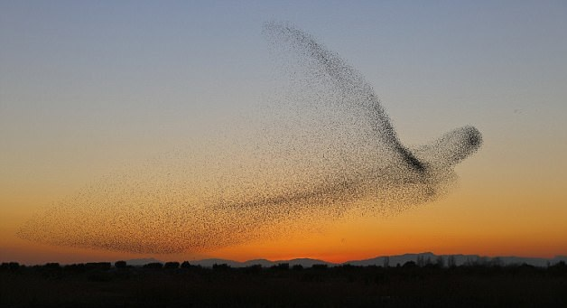

# Welcome to Yunzhi Wang's homepage!

 
[View my CV as PDF](https://github.com/phywyz-ustc/phywyz-ustc.github.io/blob/main/CV_Yunzhi.pdf)

 

## Basic Information
- Name: Yunzhi Wang (王云志)
 
- Education：  Chung-Yao Chao Talent Program in Applied Physics，School of Physics, University of Science and Technology of China, 2021.9 - 2025.6 (expected)
 
- Major：  Applied Physics (Condensed Matter Physics)

## Contact
- E-mail:    ustc23and6@mail.ustc.edu.cn

- Mailing Address:  University of Science and Technology of China(East Campus),
No.96, JinZhai Road Baohe District, Hefei, Anhui, 230026, P.R.China.

- WeChat:    zzly76

- TEL:        (+86) 198 3852 5650

## Courses
- GPA：3.32/4.3
- Ranking：87/174 (50%)
- Key Courses Taken: Advanced Statistical Physics, Quantum Mechanics, Theoretical Mechanics, Computational Physics; Mathematical Analysis, Linear Algebra, Probability Theory and Mathematical Statistics, Computational Method

## Research & Study Interests
- Active Matter
- Jamming transition
- Synchronization & Collective Motion
- Traffic Flow and Transport Theory

## Research Experiences
- 2021.9 - 2022.10：Nonequilibrium Phase Transition 
Tutor：Yuqing Wang（School of Engineering, USTC） 
Project：TASEP Theory in Traffic Flow and Molecular Motor Transport
 
 
- 2022.11 - 2023.6：Audio Information Processing with AI 
Tutor：Yan Song（School of Information, USTC） 
Project：Research on Speech Emotion Recognition Based on the Model Pre-training（Unfinished）
 
 
- 2023.7-2023.8： X-Institute, Shenzhen (Summer School) 
Tutor：Jeff Gore，Hu Jiliang (track tutor); Juan Keymer, Janneke Noorlag (group tutor) 
Project：Interactions in Kombucha and Biofilm Applications（Best Award）
 
 
- 2023.10-：Soft Matter Physics 
Tutor: Hua Tong (School of Physics, USTC)

## Teaching Experiences
- 2023FALL：Teaching Assistant, USTC, Hefei, China Course: Probability Theory and Mathematical Statistics Teacher: Wei-wei Zhuang
 
- 2024.1  : Teaching Assistant, X-Institute, Shenzhen, China Course: AFM & Surface Physics (Track3, Winter Camp for High School Students) Teacher: Alessandro Siria, Ming Ma

## Awards
- Outstanding Student Scholarship (Grade 1/Gold), 2021FA-2022AU

## Publications (Co- Author)
- Nonequilibrium phase transitions in a two-channel ASEP with binding energies and analytical evaluations via Kullback-Leibler divergence
[Link](https://doi.org/10.1140/epjp/s13360-022-02708-5)
 
- Study of nonequilibrium phase transitions mechanisms in exclusive network and node model of heterogeneous assignment based on real experimental data of KIF3AC and KIF3CC motors
[Link](https://doi.org/10.1140/epjp/s13360-022-03372-5)
